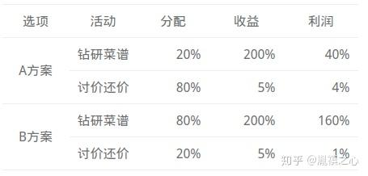

今天我想聊聊机会成本。

假如你是一个厨子，今天你有10个小时自由支配。为了让自己将来过得更好，你将怎么分配这些时间？是用2个小时研究菜式研发菜谱，然后用8个小时购物应酬讨价还价；还是用8个小时自我修炼，之后用2个小时处理那些琐碎的事。

> _The loss of potential gain from other alternatives when one alternative is chosen._

机会成本(opportunity cost) 是经济学中的概念，原指企业为从事某项经营活动而放弃另一项经营活动的机会，或利用一定资源获得某种收入时所放弃的另一种收入。另一项经营活动应取得的收益或另一种收入即为正在从事的经营活动的机会成本。我们完全可以把他延伸到个人规划和职业发展。

在上面的例子中，我们假设讨价还价和钻研菜谱的收益分别是5%和200%，尽管有时候你一下两种情况所产生的收益如下（利润=分配×收益）：

现实状况是，我们没有仔细想过，哪些事情可能产生200%的收益，哪些事情只能产生5%的收益。一方面是因为这需要长期规划而非短期规划，另一方面是因为当我们选择了A，潜意识就不在有B的存在。

明明是没有发生的事情，为什么我还要计算它的成本？是为了保证所发生的事情是真的值得去做的。子曾经曰过，富人从来不会弯下腰去捡地上的100美元，因为当他花时间做这件事情的一瞬间，就错过了赚100万美元的机会。

拿我自己举个栗子，以前周末的时候，我会花两个三个甚至四五个小时准备一顿晚餐，那时候我会庆幸我由此省下了50 或100元。后来我认识了机会成本，它告诉我，其实我仅仅是每个小时省下了30块， 20块甚至更少。假如我用这三四个小时去做用来提升自己的事情，去做那些对自己产生持续迭代效应的事情。而更为关键的，由于我把宝贵精力都花在了省饭钱这件小事儿上，并未使出浑身解数，我疲惫了，我没有精力再回过头来关注自我提升，这是恶性循环。

为了践行机会成本分析，在我做任何重要决策，比如怎么分配时间时，我主要考虑两个方面：哪些我正在做的事情不重要？以及哪些我没有机会做的事情更重要？

诚然，要实现机会成本分析，我们至少具备三方面的能力。

1.  首先是识别上述两种事情的能力。这需要我们不断修行，和自己对话，了解这个世界上自己最想追逐的是什么？
2.  其次是魄力，就是你要有胆识，并且不吝啬于，花现在看起来蛮多的钱，去帮你节省更多的时间，而后用这些时间去做更重要的事，最终将这些时间转化为真正的更多的钱。
3.  最后你需要毅力，就是坚持上述两项原则。无论旁人对你如何评价。

好钢用到刀刃上，别省那一点儿。