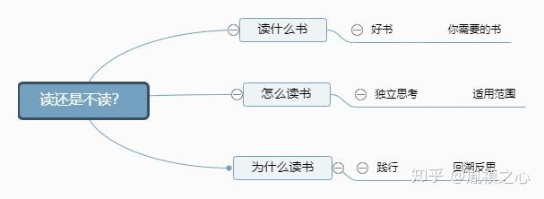

尽信书，不如无书。

当我们谈到读书这个话题，首先需要先搞清楚，读什么书？怎么读？为什么读？

先来谈谈选书问题，你需要读什么书，往往只有你自己知道。所以我们可以适当参考网上各种书单，但是最终你需要什么样的书，哪个门类哪个学科？需要通过不断的查资料，书评，最终确定了。往往很多人会关注豆瓣评分，提醒大家，除了关注评分高低，参与评分的总人数也很重要。

然后我们再来看看怎么读，过去的前辈们和现在的互联网，为我们提供了多种多样的读书方法，这里不多做赘述，仅针对题主的疑问，抛出众多读书方法中经常被提到的一个点：适用范围。不错，在读任何书的时候。碰到一个新颖的想法，精辟的观点，亦或是方法。不要急着尽数接纳，尽管作者旁征博引，我们自己需要甄别，这些观点的适用范围怎样？哪些地方可以用，哪些地方不可以用。

好了，最后我们再来谈谈，为什么读？这个答案题主已经告诉我们：用。没错，读书尤其是非虚构类图书，我们都是带着目的去读的。通过上面我们确认的适用范围，对于符合我们条件的点，一方面需要不断的重温，另一方面更重要需要践行。所谓践行分为两个层次，首先是直接用，而后根据用的效果，不断复盘，回溯反思。

可能大家经常能够在网上看到每个国家每年人均读书的统计情况，好像犹太人最多。我曾经听到一个犹太教育学者说过，其实我们从小家长并不会去比拼谁家的孩子读的书多，而我们做的更多的是，从小帮助孩子养成这样的习惯：读书的时候多想一想，既不全盘接受，也不全盘否定。