## **Black Box Testing**

Deriving test cases directly from a requirement specification

## **1\. Equivalence Class Partitioning (ECP)**

> _Equivalence Class Partitioning (ECP) is a software testing technique that divides the input data of a software unit into partitions of equivalent data from which test cases can be derived. In principle, test cases are designed to cover each partition at least once. This technique tries to define test cases that uncover classes of errors, thereby reducing the total number of test cases that must be developed. An advantage of this approach is reduction in the time required for testing software due to lesser number of test cases._

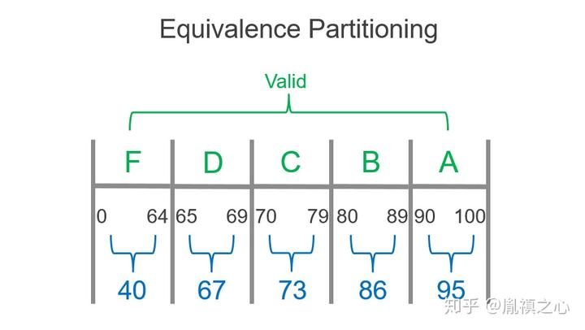

## **2\. Boundary Value Analysis (BVA)**

> _Boundary Value Analysis is a software testing technique in which tests are designed to include representatives of boundary values in a range. The idea comes from the boundary. Given that we have a set of test vectors to test the system, a topology can be defined on that set. Those inputs which belong to the same equivalence class as defined by the equivalence partitioning theory would constitute the basis._

### Step 1: Splitting value area  

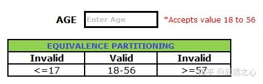

### Step 2: Analyzing boundary value

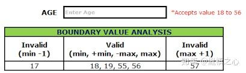

## **3\. Cause-effect graph**

> _In software testing, a cause–effect graph is a directed graph that maps a set of causes to a set of effects. The causes may be thought of as the input to the program, and the effects may be thought of as the output. Usually the graph shows the nodes representing the causes on the left side and the nodes representing the effects on the right side. There may be intermediate nodes in between that combine inputs using logical operators such as AND and OR._

### Template

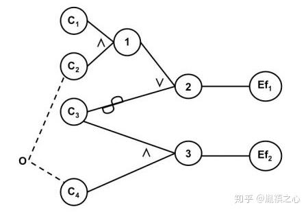

### Elements

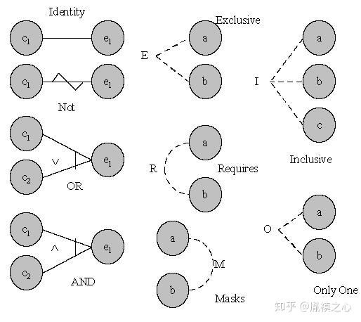

### Output: Decision Table

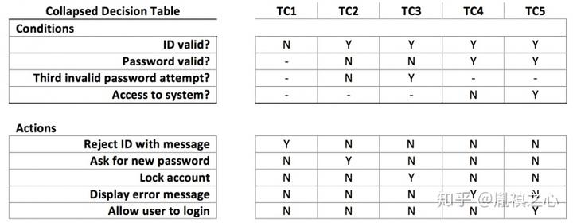

### Examples

### Step 1: List causes and effects

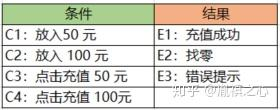

### Step 2: Draw cause-effect graph

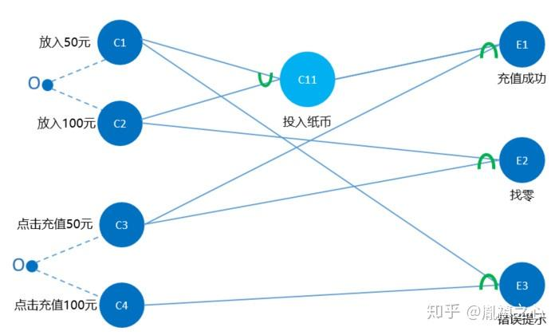

### Step 3: Draw decision table

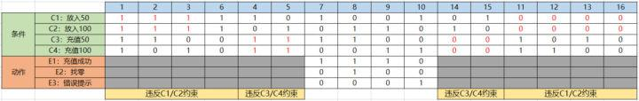

### Step 4: Come up with test cases

## **4\. State Transition Diagrams**

> _State diagrams are used to give an abstract description of the behavior of a system. This behavior is analyzed and represented by a series of events that can occur in one or more possible states. Hereby “each diagram usually represents objects of a single class and track the different states of its objects through the system_

### Example in Payment Transactions

### Step 1: Draw state transition diagram

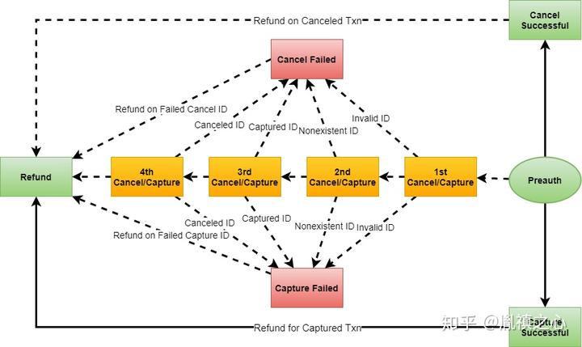

  
Step 2: Draw state transition table

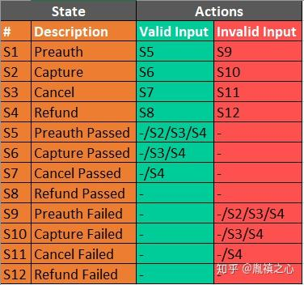

## Ad-hoc Testing

Deriving test cases based on tester’s experience on similar systems or testers intuition

## **1\. Error Guessing**

> _In software testing, error guessing is a test method in which test cases used to find bugs in programs are established based on experience in prior testing. The scope of test cases usually rely on the software tester involved, who uses past experience and intuition to determine what situations commonly cause software failure, or may cause errors to appear. Typical errors include divide by zero, null pointers, or invalid parameters._

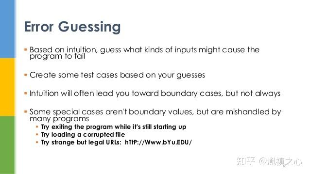

## **2\. Exploratory Testing**

> _Exploratory testing is an approach to software testing that is concisely described as simultaneous learning, test design and test execution. Cem Kaner, who coined the term in 1984, defines exploratory testing as “a style of software testing that emphasizes the personal freedom and responsibility of the individual tester to continually optimize the quality of his/her work by treating test-related learning, test design, test execution, and test result interpretation as mutually supportive activities that run in parallel throughout the project.”_

### 1\. Focusing on WHY

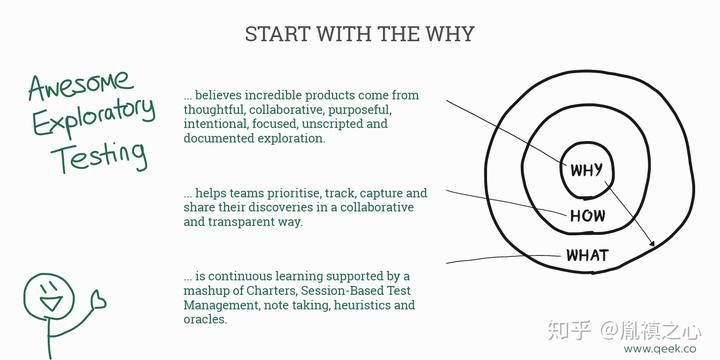

### 2\. Try whatever

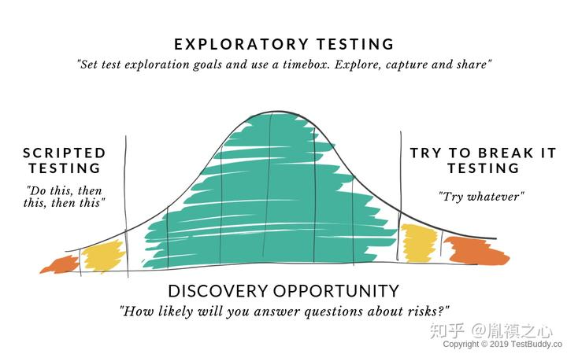

### Recommended Book

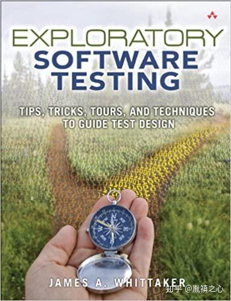