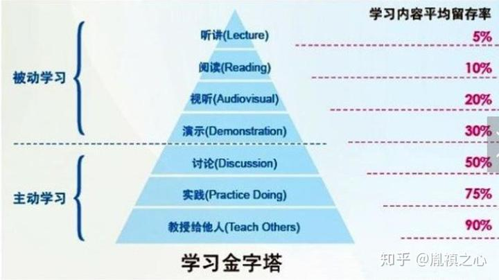

今天这标题是不是让你傻傻分不清？学习学习再学习，语出李笑来老师名言。在微观层面，我们长期单独讨论如何学习某种特定的新技能、新方法或新理论，其实从广义上，研究“学习”这个事物本身，提高“学习”的效率，更为重要。

我们日常生活中能够接触到各式各样的学习方法和途径，哪些最有效？哪些没有我们想象中的有效？此前，美国缅因州的国家训练实验室通过研究“采用不同的学习方式，学习者在两周以后还能记住内容(平均学习保持率)的多少”，对外发布研究他们的成果——学习金字塔：

我个人觉得上图更应该是倒金字塔，因为这个金字塔顶端，恰恰是我们日常生活觉得最有效的学习模式：老师在上面讲，学生在下面听。但凡是被动学习，无论采取何种途径（听讲，阅读，试听或演示），皆收效甚微，于是我想谈一些自己的感受，为什么“教授给他人”，是知识留存率最高，最有效的学习方式？

我认为你要把东西教授给他人，一般分为三个步骤：

1.  准备要教的内容
2.  教授并获取反馈
3.  更新并回应反馈

第一步，既然你要教别人，为了面子，你需要确保自己所传授的知识尽可能准确无误，同时旁征博引，准备充分的相关知识。举个栗子，你现在要教别人，如何把大象放进冰箱。于是你需要收集参考各种材料：

1.  从广度上来讲，你除了需要了解这个主题题面的东西，为了增强教授过程的专业性和趣味性，可能你还需要了解：大象的生活习性如何，大象分为哪些种类，冰箱一般都有哪些规格或者冰箱的工作原理如何等等。
2.  从深度上来讲，你需要对自己手边的材料通过批判性思维进行分析整理，哪些观点可能太片面，哪些理论不是任何时候都会起作用，不同的材料内容有没有矛盾的地方等等。这么做的目的，是为了提前预测和应变别人对你的讲授存在的异议。

第二步，你在教别人如何把大象放进冰箱的过程中，正常情况下，对方会有反馈，问题或者异议。比如，要放多久，大象如果反抗怎么办或者放到冰柜里可以吗等等。在第一步中的准备可以帮你实时回应大部分的问题或者异议，但是肯定有个别的，需要你事后寻找答案。无论如何，问题和异议是促进人类持续思考从而持续成长壮大的不二法门。

第三步，针对第二步中没法立即回应的内容，继续查阅资料和思考，刷新对于你所讲授的主题的知识库，最终给别人解决疑惑的同时，完备你的知识库。

好了，表面上看似乎上面三步的受益对象都是被教授者（即学生）。其实如果我们仔细想想，会发现：

1.  第一步可以帮助教授者（即老师）丰富自己的知识体系同时锻炼批判性思维；
2.  第二步可以提升教授者的表达能力和应变能力；
3.  第三步可以敦促教授者更新和完善他的知识储备。

于是你讲的越多，得到的反馈越多，越能完备你的知识体系。同时在第二步中，我们顺便明白了，为什么人们常说，好学生是会提出好问题的，好问题造就好老师，对学生来说，最坏的情况就是没有问题。

学习的方法很重要，这引申到关于教育制度的问题，择日再谈。