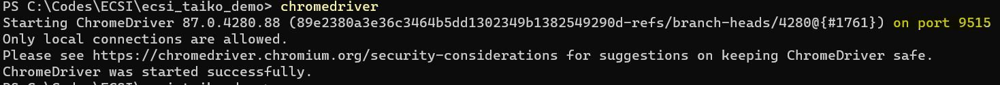

### How Does Webdriver Works?

### Classic Webdriver Workflow

### Trigger UI Automation from API Client

1.  Start the chromedriver

1.  Chromerdriver API: Open the browser

1.  Chromerdriver API: Nagative the website

1.  Chromerdriver API: Interact with the element

### Selenium + Webdriver

### Looking Back on Selenium Releases

Here’s a look at the monumental Selenium releases through the years:

> _2004: Selenium is launched._  
> _2007: Selenium IDE and Selenium WebDriver launched._  
> _2011: Selenium 2 is introduced._  
> _2016: Selenium 3 debuts._  
> _2019: Selenium 4 Alpha is released._

### How Selenium Work Together with Webdriver[](https://link.zhihu.com/?target=https%3A//yinzhenzhixin.ml/2021/01/ui-automation-migrate-from-selenium-to-taiko/%23how-selenium-work-together-with-webdriver)

### What is Selenium IDE?

### Old Selenium IDE (Based on Selenium v1)

The old Selenium IDE has been obsolete, because it’s based on Selenium RC (Selenium v1), which relys on Javascript Sandbox. It’s not stable.

### New Selenium IDE

New [Selenium IDE](https://link.zhihu.com/?target=https%3A//www.selenium.dev/selenium-ide), which debuts with Selenium v4 and relys on Selenium Webdriver, is pretty stable.

### What’s the Difference in Taiko?

### How Taiko works

[Taiko](https://link.zhihu.com/?target=https%3A//docs.taiko.dev/) is not based on Selenium, it’s based on CDP (Chrome DevTool Protocol).

### How Taiko compares to other browser automation tools

