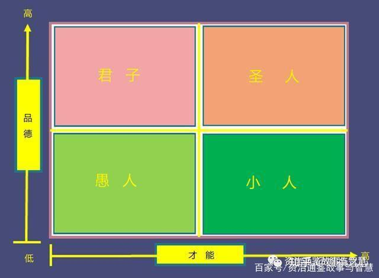

找人和用人，即人才招聘和人才培养。应该说是项目管理中必不可少的两个环节。

找人的第一步是面试。在技术面试之后的文化面试，我觉得我们可以考虑对面试者，从过去现在和将来三个方面，提出问题。

“过去”对应的是经验。需要针对应聘者所面试岗位所涉及的特定经验作出提问，同时尽量深挖。比如，你在之前相关岗位上是否遇到过一些棘手的问题？为什么这些问题棘手？你最终是通过怎样的方式解决这些问题的？

“现在”对应的是价值观和愿景，即英文中的value和vision。可以通过挖坑的方式，旁敲侧击的感受面试者的价值观，通过对比确定其与公司价值观的契合程度。比如我的公司注重诚实和客户第一，那么可以提问面试者，如果当前要交付的产品存在严重但难以察觉的缺陷，是否隐瞒客户提交产品？再比如有的公司注重个人奋斗（无偿加班），那么可以提问，面试者如果公司紧急需要某个产品交付，但是你在有限工作的时间内无法完成，诸如此类。

“将来”对应的是学习能力。此项能力在过去传统行业，可能不是特别重要。然而在日新月异，信息爆炸的今天，学习能力可能是这三项能力中最重要的。持续学习可以延缓人的衰老，人的衰老延缓了，能够更长期的持续学习，可谓良性循环。在面试过程中，可以根据所在岗位所在公司的具体要求，提出有针对性的考察面试者学习能力的问题。

面试可以帮你找到最合适的人，但并不一定能找到最优秀的人。如果要组建团队，可以对所招到的所有新人，通过由德和才组成的四象限法则，进行归类。

很多书中常以《西游记》中的取经4人组作为例子：唐僧作为管理者，需要带领德才兼备的孙悟空，有才无德的猪八戒，以及有德无才的沙和尚交付项目。

作为管理者，对德才兼备的团队成员需要给予充分的信任，将“三打白骨精”引以为戒；对有才无德的团队成员，应该用其所长；而对于有德无才的团队成员，尽可能给予充分的培养和锻炼。

谈到用人这一块，在经典管理学以及现代管理学中，有因岗设人和因人设岗之争。经典管理学，讲求因岗设人，避免因人设岗。仔细想来，上世纪三大发现之一的帕金森定理，貌似有着因人设岗的影子。

而现代管理学，对因人设岗并没有一竿子打翻，根据不同公司不同的情况，对于有些特殊的人，通过长期观察，如果确实能发现此人在某一方面的特长，可以帮助公司创造特殊的价值，是可以区别对待，为此人开设专门的岗位。这里有个大前提，就是公司不差钱儿。