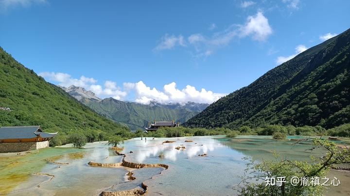
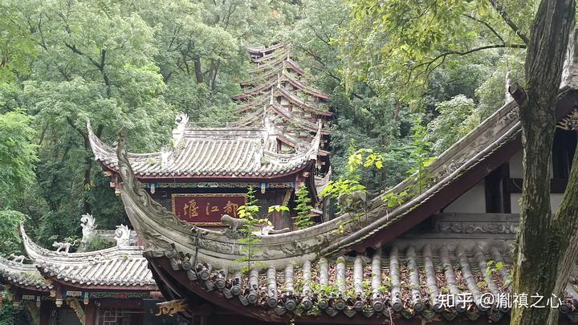
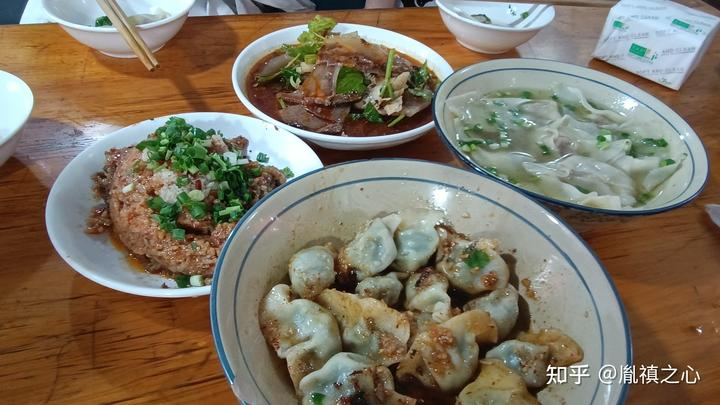

近日一家五口成都九寨沟六日行，平安归来，例行retro。

## 赏心悦目

### 九寨沟

九寨沟和黄龙整体来说很不错，自然风光特别好。九寨沟属于我目前去过的最大的景区，没有之一。整个景区分为三条主线，呈Y字型。我们全天游览了八九个小时，由于老人小孩同行，走的比较慢，只完成了两条主线，由于景区比较大，三条主线之间的交通主要靠景区内的浏览车（其实就是公交车）。景区内没有太多的商业气味，主要靠走。小的景点之间，植物比较茂密，基本上从头到尾都有水和你同行，并且水特别的清澈，不会觉得。期间队友为了保护遮阳帽，不小心把手机掉进了水沟，在高处可以清楚的看见手机画面。好心的景区清洁人员主动用长杆捞回手机，主动热情。

### 黄龙

相对于九寨沟，黄龙景区小很多。个人感觉没有导游口中传说的对心脏不好人士那么不友好，索道上行到达顶点后，并没有太多不良反应。当然无论是九寨沟还是黄龙，紫外线都特别强，所以需要做好充分防晒准备。在九寨沟走了2/3的行程没有怎么碰到过水池，这一点在黄龙恰好弥补了。黄龙的水池积了不同颜色的水，美不胜收。

### 都江堰

相对于离成都有8个小时。大巴车城的九寨沟和黄龙，都江堰给我留下了更深刻的印象。都江堰离成都特别近，因为属于成都的后花园，如果坐城际铁路只需要半个小时即可从成都地铁跑犀浦（也就是郫县）到达，即便从成都市区总共也只需要到一个半小时的铁路车程。都江堰所称成都后花园，是一个比较大的带山带水的公园，有机会还想再去一次里边氧气含量特别充足。行走其中，给人很舒服的感觉。

### 成都熊猫繁殖基地

这里和都江堰的竹林，都是在西安看不到的，非常的浓密矫健。虽然来这里的人主要是看熊猫，不过融合了夏天，暑假，大运会这几个元素，讲真除非你一大早5点来排队，否则即便等到8点开门做生意再进去，国宝们累了，花花拒绝见客。倘若你买的是下午票就...退了吧。

### 土桥清真寺

也叫清真上寺，位于成都市金牛区，2号线金科北路站出站走5分钟就到，离市中心较远，但是相对于市中心皇城清真寺周边的清真餐饮店，这里的更具成都回族特色，川派粉蒸肉，凉拌肺片还有饺子和抄手都很久特色而且西北人吃得惯，皇城清真寺旁边的牛排面，兰州拉面和麦德堡，就...你在西安也能吃到更好的更便宜的。

## 反省改进

### 高铁

本次行程最尴尬和悲催的一点，就是低估了到达高铁站之后进站需要预留的时间。去程时，只预留了15分钟的时间。进站时全家人拼命奔跑，然并卵，最终依然遭遇了惨痛的一幕：按照中国高铁规定。已经启程的车次只能改签，并且只能改签当天的连座车次，拒绝退票。导致我们计划的早8点的班次，由于客流量较大以及时间紧，只能改签为无座的晚8点的班次。浪费了整整一个白天的时间，辛苦了老人和孩子，深表歉意。无独有偶，尽管我在回程的时候吸取经验教训，预留了30~40分钟的进站时间，结果由于前往高铁站的地铁临时停留了10分钟。回程进站时，家人依然在拼命的奔跑，所幸最终在列车启动前8分钟到达列车旁。所以，作为action plan，高铁虽然不需要像我们班那样预留两个小时以上的时间，但严重倡议预留45分钟，最好1个小时的时间用于进站，早到的我在那斗地主也比跑步愉快啊。

### 门票

都江堰市主打的两个景区：都江堰和青城山，本次行程第二大憾点，就是没去成青城山。由于上述经历。第1天的行程作废，导致其后行程多少有些影响，并且由于没有提前预定门票，又赶上大运会这个节骨眼，原计划都江堰和青城山的自由行由于都江堰门票无法提前一天预定，加上大家更向往前者，随即改为都江堰跟团一日游，比较被动。之前听很多人建议，一天就可以浏览完两个景点，然则实际走下来，如果带老人和小孩，或者希望充分浏览，非常建议分别用一天浏览两个景区，毕竟在后花园多吸吸新鲜空气没有坏处。所以呢，建议任何景区门票至少提前5天预订，因为使用主流手机订票应用，比如大众点评，订票都是可以无条件退票的。

### 必备物品

如果去山里边，尤其是阿坝州或者都江堰这种，有可能同一个景区里一片下雨一片阳光的地方，防寒防雨非常关键。提前准备外套雨具，并且随身携带，有备无患。

### 老人小孩

与老人小孩一起出行的话，行程不要安排的太紧。根据个人经验，5A景区一般比4A景区要大。所以跟随老人小孩一同出游的话，5A景区一天至多安排一个，并且尽量选择自由行，否则他们会比较赶，得不偿失，毕竟很多地方对老人来说，这辈子只去那么一次。

### 旅行社

之前有人提到过选择旅行社的话，尽量选择国旅青旅这种规模较大的实际体验下来，导游的专业程度以及行程安排的合理性，似乎与旅行社的大小没有直接关系。由于三年疫情导致的经济不景气。基本上旅游行业目前处于充分竞争状态，小旅行社也在拼命的与客户搞好关系。据我们遇到的不知名旅行社导游“透露”：三年前他们宁愿选择到景区后，付少量费用，让景区内导游代班，目前都得亲自上阵，遇到夏天，他们走的讲的满头大汗，看起来非常辛苦。

### 酒店

成都应该算是比较大的城市，酒店非常多，在预算允许的情况下可以结合。城市地铁规划图以及整体行程安排。尽量选择。离景区比较近或中转比较高效的酒店入住。

### 时间

基于我国的国情，目前来看，暑假和旅游形成了暂时不可调和的矛盾。因为，旺季，比如寒暑假，人真的非常的多，所以如果想要一个比较惬意的旅行体验，尽可能的选择，非旺季出行。尤其对于老人来说。那个地方他可能这辈子只有这一次机会去了。既然要去，就应该选择一个人少的时期去，选择一个可以走的不太着急的时间去。