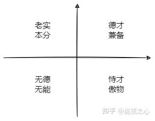

日常工作中，遇到棘手问题是常事，针对采取不懂解决方法的不同的人，公司更喜欢哪一种？公司发展更需要哪一种？

举个栗子，有一天，中午饭点到了，大家准备去吃饭，有个客户来公司视察，恰逢此时饿了，急着去吃饭，看到电梯人多，楼梯人也多。对客户来说，这是个问题，需要有人帮忙探索解决，于是找到某员工，希望其帮忙解决问题， 快速下楼。

该员工有两个选择：

1.  跟客户排队坐电梯，挤点，但是快；
2.  跟客户爬楼梯，类点，但是能下去。

从德才四象限来看不同员工可能的反应：

1.  但凡有德者，无论是否有能，都会尽力帮客户想办法，尽快行动起来让客户安心，过程中竭尽全力，能解决的问题尽力解决，解决不了的主动和客户沟通确认；
2.  有能的，无德的，至少也会出奇招阴招，努力让客户看到自己努力了，解决了问题也罢，解决不了也罢，最终获得客户的认可。

无德无能之人，或许会增加选项3，劝客户晚点去，或干脆别去吃饭了。你没听错，他们仿佛没有听见或看见客户饿了，他们的理由听起来也很有道理，他们试图把这些道理讲给客户，他们想尽办法让客户明白，电梯人确实多，走楼梯确实累，可是他们并不明白客户已经明白这些，以及他们想让客户继续饿着。

工作中的德是什么？我认为是态度，是积极的态度，积极的态度包含两层含义：第一，无论结局如何，至少我们曾经努力过，这就好比有人说的，最大的勇气不是去死，而是继续活下去；其二，主动反馈，努力的过程肯定有新发现，主动让客户知道这些，同时记录下来，那些经验这次用不上，下次难免用上；同时我们需要解决的问题往往处于复杂系统中，正因为这样，我们并不知道过程中会有怎样的机缘巧合，不试一试，怎么知道合不合适呢？

人是铁，饭是钢，赶紧让客户填饱肚子吧！