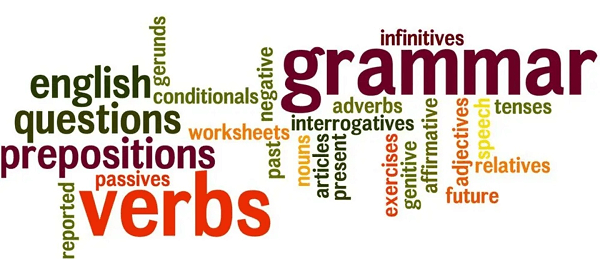

I used to struggle with the differences between past simple and present for my years. Let me try to sum up what I learnt recently.

## Past Simple

### Completed actions in the past

> I studied for my exam yesterday.

_The studying is finished now._

> She visited France last summer.

_The visit is over._

> We bought a new car in 2022.

_The buying happened and is not ongoing._

### Specific points in the past

> At 8:00 PM, they left for the party.

_Specific time frame in the past_

> In 2005, the hurricane hit the coast.

_Specific historical event_

### Habits or repeated actions in the past

> I used to go to the gym every day.

_The habit stopped before now_

> She always wore red on Fridays.

_Repeated action in the past_

## Present Perfect

### Actions starting in the past and continuing to the present

> I have lived here for ten years.

_Living started in the past and continues now_

> She has written three books.

_Writing started in the past and is ongoing_

### Actions finished in the past but with a present connection

> I have lost my phone.

_The phone is lost now, due to an action in the past_

> We have eaten already.

_We are not hungry now, because we ate in the past_

### Unspecified time in the past

> I have seen that movie before.

_Doesn't matter when I saw it_

> She has never been to Japan.

_No specific time mentioned_

## More Examples

The train departed at 10:00 AM.

_Specific time in the past_

We have traveled by train many times.

_Started in the past, still relevant now_

> I lost my keys yesterday.

_Finished action in the past_

> I have lost my keys, so I can't find them.

_Lost in the past, affects the present_

___

## Tips

1.  Past simple uses a verb form like "studied," "visited," "bought." while present perfect uses "have/has" + past participle (studied, visited, bought).
2.  If you have a specific time in mind, use past simple.
3.  If the action started in the past and has some relevance to the present, use present perfect.
